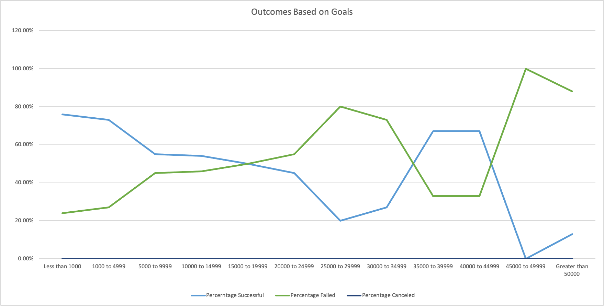

# An analysis of Kickstarter Campaigns

## Overview of Project
### Purpose
    the purpose of the project is to bolster knowledged about handling large data sets as well as extracting specific data from
    different sections of the data set in order to represent different areas of interest. There are two seperate fileds that I 
    will be measuring and they are the launch dates of each kickstarter and the goals set for each kick starter.

## Analysis and Challenges

### Analysis of Outcomes Based on Launch Dates
    In order to organize the outcomes of theater projects based on the launch date of the file, I created a pivot table and a pivot chart
    to represents the outcomes. The rows are labled based on the dates of each project and the columns are labeled with the outcomes. 
    The chart depicts which months are where the projects are more likely to be successful.
    
    
### Analysis of Outcomes Based on Goals
    To analyze the outcomes based on the goals of each theatre porject I created a descriptive statistics of each different goal range
    and their success rates compared to the percentage failed. The rows represent the different goal range.
    
    
### Challenges and Difficulties Encountered
    There were seperate different challenges and difficulties I encountered when working with the data. When putting  together 
    the pivot chart I initially did not know that the dates were alread pregrouped by  years so I did not know that the data 
    was already organised. In addition, I had to format the graph so that the graph will show the relevant data. As for the 
    outcomes based on goals; the challenges I faced when constructing the data set was that I initially forgot to filter out 
    the plays so it took a while for me to figure out why I was handligng with a larger data set then it needed to be.

## Results
